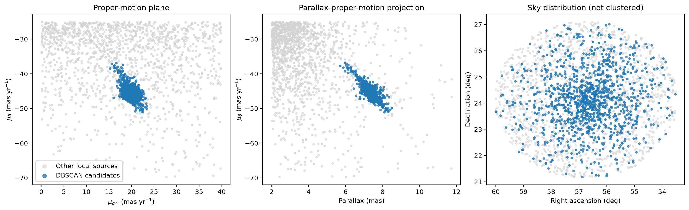
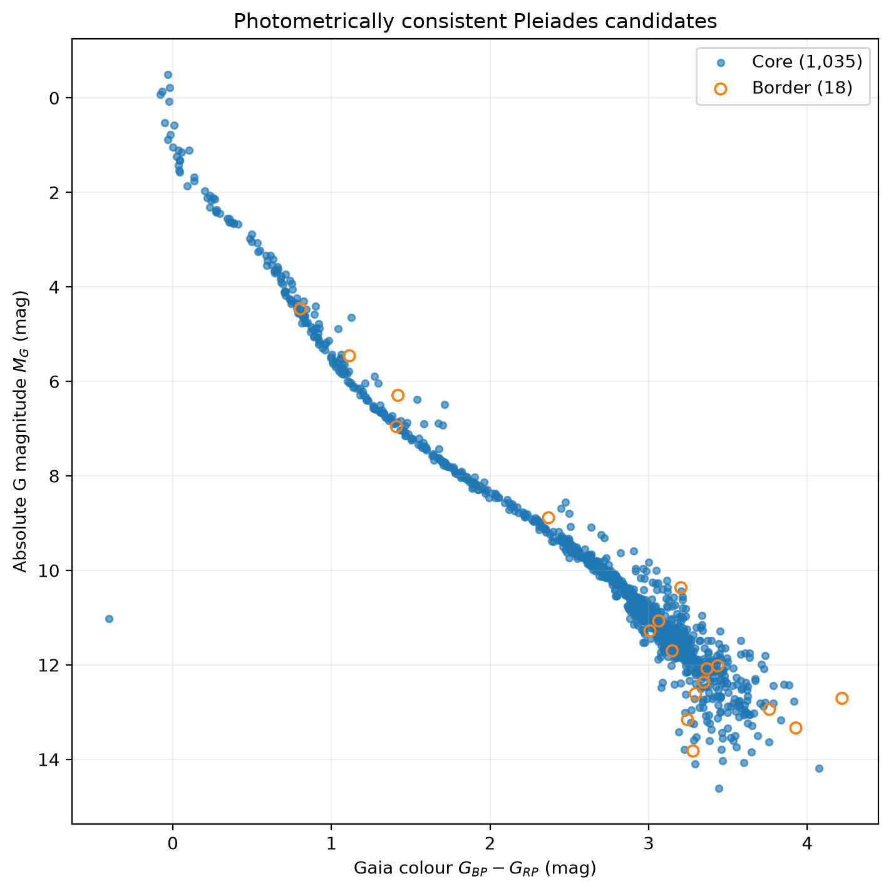
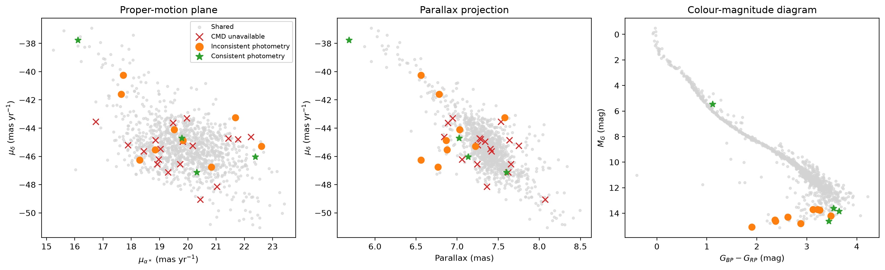
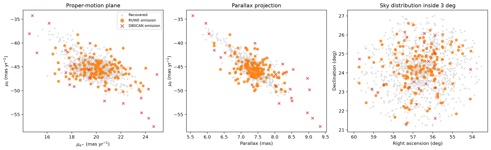

# Pleiades membership with Gaia DR3

This project identifies candidate members of the Pleiades using Gaia DR3
astrometry. The membership analysis uses parallax and proper motion, tests the
sensitivity of DBSCAN to its parameters, validates the resulting stellar
sequence with a Gaia colour-magnitude diagram (CMD), and compares the candidates
with the published Gaia DR3 cluster catalogue of Hunt & Reffert (2023).

The analysis covers a 3-degree radius around approximately RA = 56.75 degrees
and Dec = 24.12 degrees.

## Main result

The baseline DBSCAN model uses:

- Features: parallax, `pmra`, and `pmdec`
- A broad local analysis window of 2-12 mas in parallax, 0-40 mas/yr in
  `pmra`, and -70 to -25 mas/yr in `pmdec`
- Standardized features
- `eps = 0.18`
- `min_samples = 10`

It identifies 1,185 provisional Pleiades candidates:

- 1,154 DBSCAN core points
- 31 DBSCAN border points
- 1,167 sources with the measurements required for a Gaia CMD
- 1,053 sources within the exploratory 3-sigma corrected BP/RP flux-excess
  envelope
- 1,154 matches with Hunt & Reffert (2023)

This corresponds to 97.38% of our candidates appearing in the published
catalogue. Within the original 3-degree footprint, the analysis recovers 86.77%
of the published members.

The high agreement, stable DBSCAN solution, spatial concentration, and coherent
CMD sequence jointly support the candidate selection. The result remains a
candidate catalogue rather than a definitive membership-probability model.

## Result preview

| Astrometric selection | Photometric validation |
|---|---|
| <br><sub>The candidates form a compact sequence in parallax–proper-motion space and concentrate toward the cluster centre on the sky, supporting the astrometric DBSCAN selection.</sub> | <br><sub>The photometrically consistent candidates trace a narrow Gaia colour–magnitude sequence; the few border points and outliers qualify the selection as a candidate catalogue.</sub> |

| Catalogue agreement | Missed-member audit |
|---|---|
| <br><sub>Candidates absent from the published catalogue are compared with shared members in astrometry and the CMD, showing that only a small subset also follows the cluster sequence photometrically.</sub> | <br><sub>Published members missed within 3 degrees are separated into RUWE and DBSCAN omissions, illustrating the reliability–completeness trade-off rather than a query-footprint loss.</sub> |

## Analysis notebooks

Run the notebooks in numerical order:

1. `Notebooks/01_pleiades_data_query.ipynb`
   - Queries Gaia DR3 in non-overlapping chunks.
   - Preserves a broad surrounding field without astrometric membership cuts.
   - Combines 255,553 sources into the raw 3-degree catalogue.

2. `Notebooks/02_data_cleaning.ipynb`
   - Audits missing astrometry and photometry.
   - Requires finite parallax, `pmra`, and `pmdec`.
   - Applies the exploratory quality criteria RUWE < 1.4 and at least nine
     visibility periods.
   - Produces a cleaned catalogue containing 214,953 sources.

3. `Notebooks/03_dbscan_membership.ipynb`
   - Constructs and standardizes the astrometric feature matrix.
   - Examines nearest-neighbour distances.
   - Tests `eps` and `min_samples` sensitivity.
   - Identifies and inspects 1,185 provisional candidates.
   - Records DBSCAN core and border status.

4. `Notebooks/04_colour_magnitude_diagram.ipynb`
   - Calculates Gaia BP-RP colour and absolute G magnitude.
   - Validates the candidates using their CMD sequence.
   - Calculates the corrected BP/RP flux-excess factor following Riello et al.
     (2021).
   - Preserves CMD availability and photometric-consistency flags.

5. `Notebooks/05_catalogue_comparison.ipynb`
   - Downloads or loads the Hunt & Reffert (2023) Gaia DR3 Pleiades members.
   - Matches exact Gaia DR3 source identifiers.
   - Accounts for the original 3-degree footprint.
   - Investigates additional candidates and missed published members.
   - Saves the final comparison catalogue and missed-member audit.

## Important output files

### Raw data

- `data/raw/gaia_dr3_pleiades_3deg_all_sources.fits` contains the unmodified
  combined Gaia query result.
- `data/raw/hunt_reffert_2023_melotte_22_members.fits` contains the unmodified
  CDS/VizieR Pleiades member table used for comparison.

Raw files should not be overwritten by cleaning or membership experiments.

### Processed data

- `data/processed/gaia_dr3_pleiades_3deg_cleaned.fits` is the cleaned field
  catalogue used for clustering.
- `data/processed/gaia_dr3_pleiades_dbscan_candidates.fits` contains the 1,185
  provisional astrometric candidates and their DBSCAN roles.
- `data/processed/gaia_dr3_pleiades_candidates_cmd_validated.fits` adds CMD
  quantities and photometric-quality flags while preserving all candidates.
- `data/processed/gaia_dr3_pleiades_candidates_catalogue_compared.fits` is the
  main final catalogue. It adds the published match status and Hunt & Reffert
  membership probability where available.
- `data/processed/hunt_reffert_2023_members_missed_inside_3deg.fits` records the
  176 published in-footprint members omitted by our final selection and the
  pipeline stage responsible.

## Reproducing the project

Create and activate a virtual environment, then install the dependencies:

```powershell
python -m venv .venv
.\.venv\Scripts\Activate.ps1
python -m pip install -r requirements.txt
```

Launch Jupyter from the project root and run the notebooks in numerical order:

```powershell
python -m jupyter notebook
```

Notebook 01 requires access to the Gaia Archive when downloading data.
Notebook 05 requires CDS/VizieR only when its published catalogue is not already
cached in `data/raw/`. The remaining notebooks use local files produced by the
earlier stages.

### Repository data policy

Downloaded and generated FITS files are excluded from Git. Their directory
structure and regeneration instructions are documented in
[`data/README.md`](data/README.md). The exported figures are included so the
main results remain visible on GitHub without committing tens of megabytes of
catalogue data.

For a citable data release, attach the two final processed FITS files to a
GitHub release or deposit them in a scientific data archive rather than adding
them to the Git history.

## Scientific interpretation and limitations

The 176 published members missed inside the footprint were traced through the
pipeline:

- 154 were excluded by RUWE >= 1.4.
- 22 survived cleaning but were not selected by DBSCAN.
- None were lost because of missing core astrometry, the original query, or the
  broad local astrometric window.

The RUWE result illustrates a reliability-completeness trade-off. Genuine
binaries can have elevated RUWE, so those sources should not automatically be
treated as non-members. The DBSCAN omissions have substantially lower published
membership probabilities and generally occupy lower-density astrometric edges.

Important limitations include:

- The analysis does not assign calibrated membership probabilities.
- DBSCAN does not use individual Gaia uncertainties or astrometric
  correlations.
- RUWE < 1.4 is a documented exploratory choice, not a universal criterion.
- Absolute magnitudes use direct parallax inversion without a zero-point or
  extinction correction.
- Sources outside the 3-degree footprint cannot be recovered.
- Field stars can overlap the cluster's astrometric and photometric sequences.

## References

- Hunt, E. L. & Reffert, S. (2023), *Improving the open cluster census II: An
  all-sky cluster catalogue with Gaia DR3*, A&A, 673, A114.
  https://doi.org/10.1051/0004-6361/202346285
- Riello, M. et al. (2021), *Gaia Early Data Release 3: Photometric content and
  validation*, A&A, 649, A3. https://doi.org/10.1051/0004-6361/202039587

This work has made use of data from the European Space Agency mission Gaia,
processed by the Gaia Data Processing and Analysis Consortium (DPAC).

## Project structure

```text
pleiades-gaia-project/
|-- Notebooks/       # Numbered analysis notebooks
|-- data/
|   |-- raw/         # Unmodified Gaia and published-catalogue data
|   `-- processed/   # Cleaned, candidate, and comparison catalogues
|-- figures/         # Exported diagnostic and scientific plots
|-- requirements.txt
`-- README.md
```
